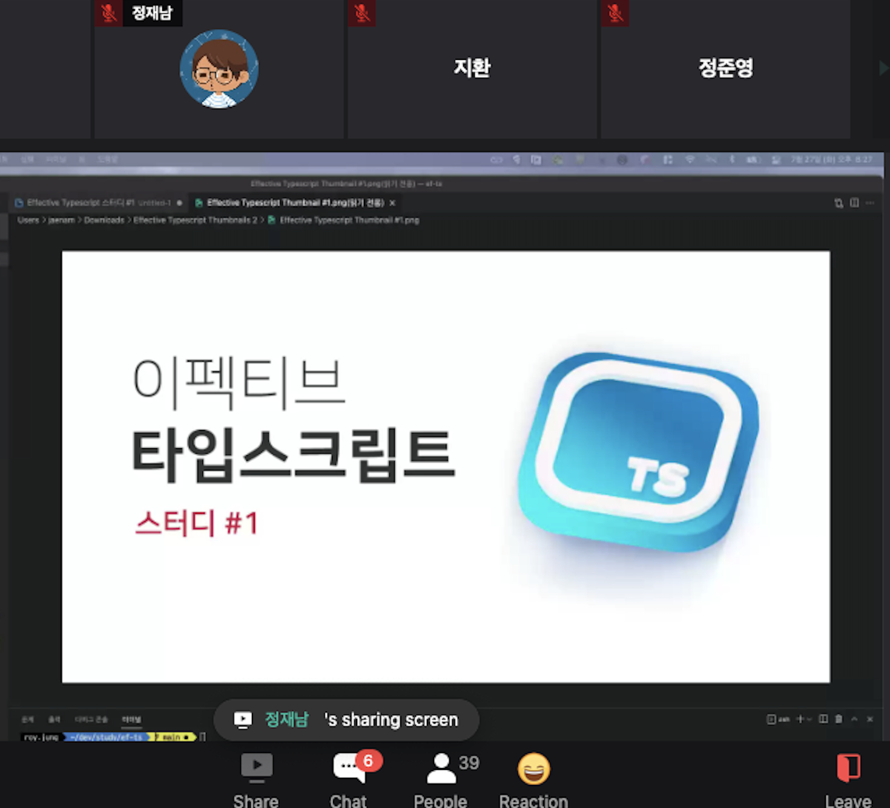
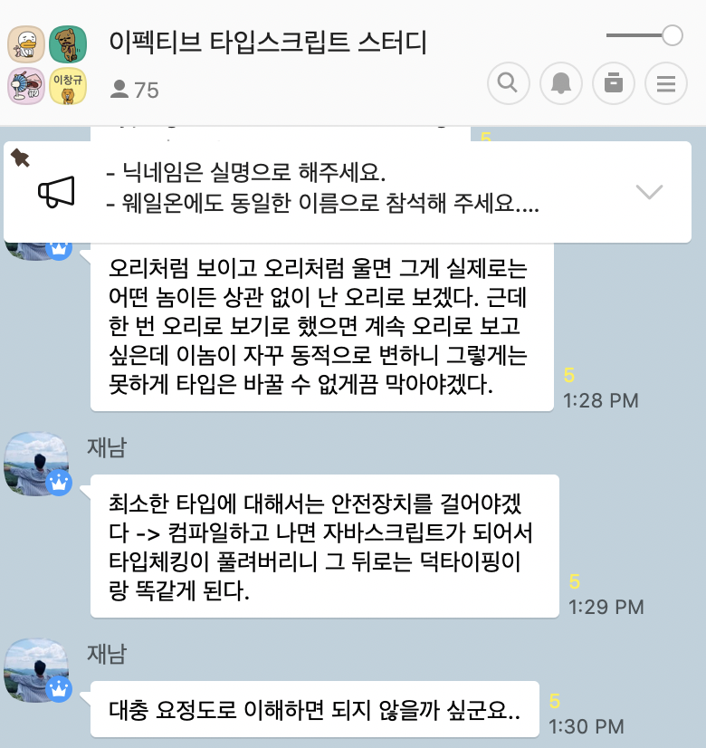

# Typescript-Study

이번에 회사 지인 추천으로 같이 스터디를 하게 되었다.

**정재남\(**[**Github**](https://github.com/roy-jung)**\)** 분이 운영하는 Typescript 스터디이다. 처음에 이분이 어떤분인지 몰랐는데, 유명하다고 해서 좀 찾아봤다. Core Javascript 저자이며, 여럿 인프런 강의를 하신 분이다. ts를 잘 모른다기에 의아하게 생각했는데, 같이 스터디를 해보니, 명확하게 넘어가고 싶어하시는 분이라는 것을 알게 되었다. 좋은 경험이 될 거 같다.

이 스터디는 [이펙티브 타입스크립트](https://www.aladin.co.kr/shop/wproduct.aspx?ItemId=273193135) 책으로 진행하게 된다.

**Typescript 기초 스터디라고 하기에... 복습이나 하자는 생각으로 스터디에 들어갔지만, 너무 많은 것을 알게되고 있어서 좋다.**

