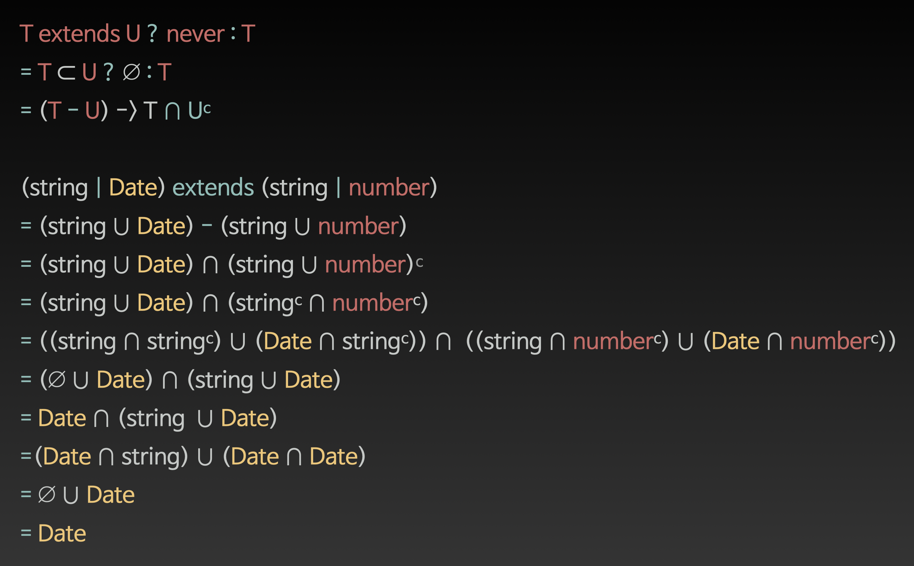

# 2회차\(2021.07.29 목\)




```typescript
type A = Exclude<string | Date, string | number>; //D ate
```

결과값음 Date가 나온다. 하지만, 재남님이 Exclude 정의대로라면 string\| Date가 나와야 하지 않냐고 물으셨다.

```typescript
type Exclude<T, U> = T extends U ? never : T;
```

T가 나와야 하기에, `string | Date` 가 나와야 할 거 같지만, 결과는 Date만 나온다. 직관적으로, string하고 Date를 개별적으로 한다는 것을 알았지만, 확실하지 않았다. 스터디가 끝나고 재남님이 증명을 해주셨는데 너무 놀라웠다. 나라면 그냥 넘어갔을 일을, 위에 사진처럼 증명을 한 것이다. 

**이번에도 느끼느 거지만, ts 기초 스터디라고 하기에... 복습한다는 생각으로 스터디에 들어갔지만, 너무 좋은 것을 알게되고 있어서 좋다.**

